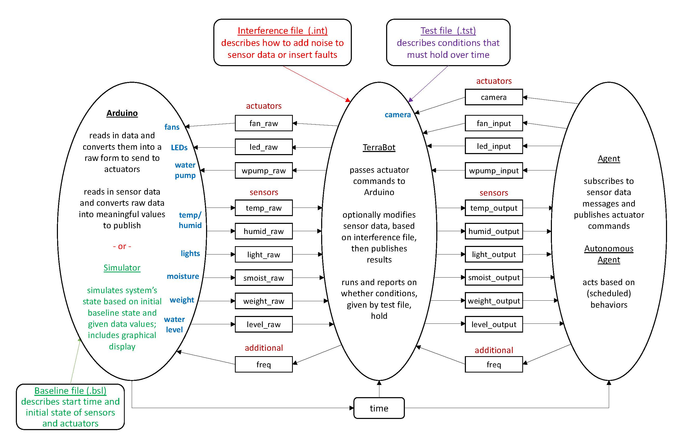

# Autonomous Agents TerraBot Mk1 #

## Overview ##
Welcome to the Autonomous Agents TerraBot project! For this project you and your partner(s) 
will be given a greenhouse outfitted with multiple sensors and actuators and 10 small pots
with recently sprouted seeds. The goal of the assignment is to provide the best environment
for the plants during a two week grow cycle. Each cycle will come with new challenges, so
be prepared!  

### The System ###
The physical greenhouse you are assigned is only part of the system which you will be 
working with, which is in turn a small part of the system the entire class will working with!  
In control of each box there is a aurdino managing the sensors and actuators and a raspberry
pi where you will run your code. At the beginning of the grow cycle you will be allowed
to upload your code onto your assigned raspberry pi. If, during any point of the grow cycle,
you feel as if you must re-upload your code you are free to do so at a penalty. The point
of this assignment is for the greenhouse to be self sustaining, so it would not make sense
to constantly be changing the program!

### Whats in the box? ###
In order to help maintain a healthy environment for the plants you will need to be able 
to understand the sensor data to determine the current state and activate the actuators
to improve that state when necessary.
We have provided all the sensors and actuators we believe to be neccesary to complete the 
given tasks. These include:  

| Sensors                     | Message Type | Actuators             | Message Type |
|-----------------------------|--------------|-----------------------|--------------|
| Total disolved solids (tds) | INT32        | LED (led)             | Int32        |
| Current (cur)               | Float32      | Water Pump (wpump)    | Bool         |
| Light (light)               | Int32        | Nutrient Pump (npump) | Bool         |
| Water Level (level)         | Int32        | Air Pump (apump)      | Bool         |
| Temperature (temporary)     | Int32        | Fan (fan)             | Bool         |
| Humidity (humid)            | Int32        |                       |              |

## Understanding ROS ##
In order for you to communicate to and from the machine we will be using the Robot Operating System
(ROS). For the purposes of this assignment we will only be scratching the surface of what ROS is 
capable of. We will be Using ROS mostly for its messaging features. Each sensor and actuator will
send information over a ROS topic of a specific type (shown above). In order to work with the system
your code will create a ROS node which subscribes to each of the sensors topics and publishes to 
actuators.  
A visual is included in the "understanding the system" section to help further explain.  
The Terrorium consists of three nodes, one for an arduino, one for a relay to translate data,
and one that you will include. In order to get your code working with the ROS messaging system
follow the tutorial on their web-site [here](https://wiki.ros.org/ROS/Tutorials).
You may find the other tutorials there helpful as well! Be sure to check 
your code to make sure that it is publishing and subscribing as you intend when bug fixing.
## Setting up the virtual machine ##
Because of the nature of the assignment it is impossible to run any tests of your code before
or between grow cycles. In response you could simply change your code once it is on the machines,
but each time you do you will be penalized! In order to avoid those penalties and allow you to
test your code, we have included a simulator which closely mimics an actual greenhouse. In order
to run a simulated version of the system you will need to have ROS installed on your 
own machine. Because of the OS restrictions we believe that the best way to do this is with a
ubuntu virtual machine.

### Installing Virtual Box ###
Follow the instructions [here](https://www.wikihow.com/Install-VirtualBox) for installing 
VirtualBox, a software which help you easily create virtual machines.

### Downloading the Operating system ###
We recommend that you download ubuntu 32 bit [here](https://ubuntu-mate.org/download/) to most
accurately mimic the experience that you will have on the pi. (any ubuntu distro should be valid
though this is the only one we have tested)

### Downloading the Simulator ###
TODO Find out how students will get the simulator

### Downloading ROS ###
On an ubuntu virtual machine please follow the instruction
[here](https://wiki.ros.org/melodic/Installation/Ubuntu_) for installing ROS.
Keep in mind that only the Desktop install is neccesary. Depending on your internet connection
this step may take a while.

## Running the Simulator ##

## Understanding the System ##
As mentioned earlier, there are three ROS nodes in this system: the one you will provide, a relay node
, and the arduino. All communication to and from the arduino is done via the relay node, meaning you should
never access the same topics as the aurdino. In the relay the data is translated from its raw input
to a more usable scale (or vice versa), this is done via an external interference file. In order to
reliably simulate errors which may happen by chance if run in the real world the interference file
may be malicious causing the relay to act incorrectly.

The above image shows an overview of the connections between the different nodes in the system.
Notice all the topics connected to the student, as those are the ones you will be using to 
regulate your greenhouse.

### Misc Notes ###
In order to allow for greater control of the system and to ensure the accuracy of the simulator
there are a few extra processes which you have access to. On top of the previously mentioned sensors
and actuators there will also be a health ping, time, and frequency node which you must consider.

#### Health Ping ####
Because of the long lasting nature of this project it is possible that there may be unforeseen
errors in your code which cause it to crash. Crashed code means no control over the system and 
certain doom for your plants! In order to avoid this outcome we have included restart functionality.
When the relay begins it will run your code and listen for a ping. If your ping is not heard within
a set amount of time (default 60 min) it will assume your program has crashed and restart it.

#### Frequency ####
The frequency topic is used to determine how often the arduino will read from the sensors. 
The more often you read the more accurate your data will be, but the more power you will draw.
Notice that this setting is variable, meaning it can be changed over the course of the program.

#### Time ####
There are many reasons why you may want to be able to access the time in your code, but it is also
important that the execution of the simulator is identical to the relay (even if sped up). 
To ensure consistency between the two your code should refrain from referencing outside functions
(OS time.time()) and should instead refer to the ROS time topic via rospy.get_time(). 

## Understanding the Simulator ##
The simulator works in a way almost identical to the three node process which will run when your
code is uploaded to the raspberry pi. The code for your node and the relay node is the exact same
as it would be on the pi. Instead of having an arduino node, however, the simulator comes with a 
farduino (fake arduino) node which mimics the actions of the arduino node. This difference should
in no way affect the way your code operates, and should not be noticeable from the perspective
of your node.

### Running the Simulator ###
In order to get the simulator all you need to do is run the relay.py with the -s flag, the
multiplier you wish for the speed, and the time which you would like it to start at (seconds since
epoch).  
For example if I wanted to run the simulator at 1x speed at epoch I would run:  
>`python relay.py -s 1 0`  
For error checking it is recommended that you include the -l flag for logging as well.  
EX: 5x speed with logging
>`python relay.py -l -s 5 0`  

### Camera ###
The one aspect of the system which we are not able to simulate is the camera. Any call to 
raspistill will result in an error as there is no camera connected to the virtual machine
and raspistill is not installed.

### Time ###
One of the most convenient aspects of the simulator is its ability to manipulate time to 
suit the users needs. By default the simulator will begin running at 1x speed at the epoch,
but that can be configured with the -s flag.

## Uploading to the Greenhouse ##

## Grading ##

